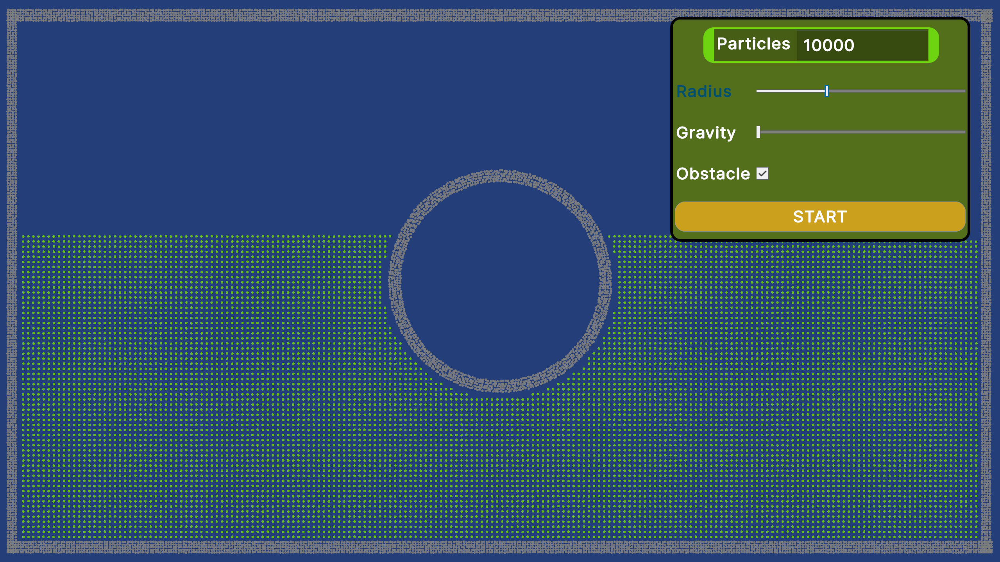
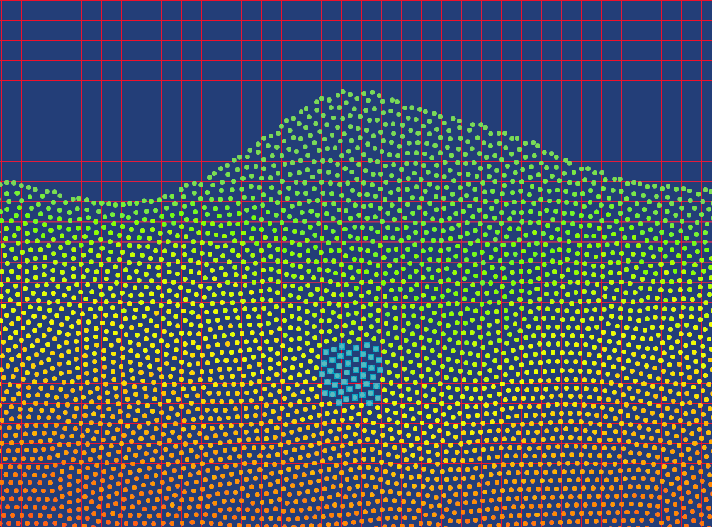
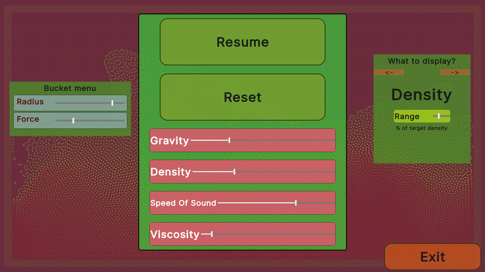
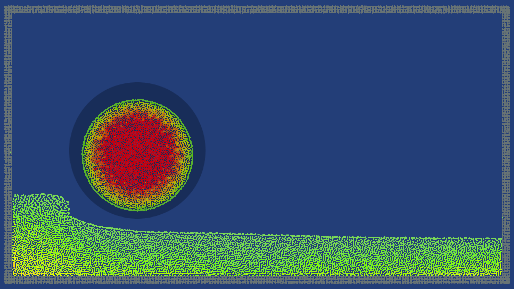

# Installation of the application (WINDOWS):
    1. Download latest version of the installer (https://jerzozwierz.itch.io/kulkijg/)
    2. Run instaler_KulkiJG.exe
    3. Run program KulkiJG.exe
[installer](https://jerzozwierz.itch.io/kulkijg/)  
Typical problem: app can be stopped by Windows Smart Screen. In this case you need to click "More" and "Run anyway". Do not worry, this is just a result of me not having money to buy a certificate. Thus each version needs to build reputation with smart screen. I hope to aquire signing certificate in the future.

# Controls in the simulaton
### Setup:
    1. Number of particles
    2. Smoothing radius of SPH
    3. Gravity force
    4. Toggle obstacle swtich
.
### Space bar - pause
In pause menu one can see hashing cells and (after clicking) particle's neighbours

.
### ESC - main manu

.
### Left/right click
attract/repel particles

.
